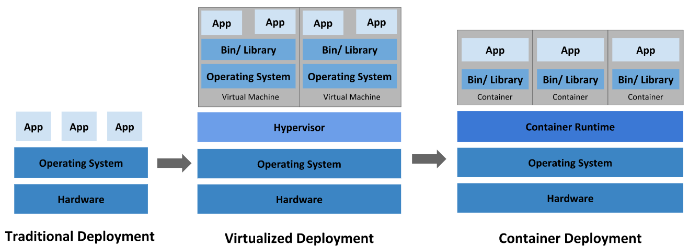

# What is Kubernetes

Kubernetes is a portable, extensible, open-source platform for managing containerized workloads and services, that facilitaes both declarative configuration and automation.

## Going back in time

**Traditional deployment era**: Early on, organizations ran application on physical servers. There was no way to define resource boundaries for applications in a physical server, and this caused resource allocation issues. Meaning, applications had to fight for limited resources. A solution for this would be to run each application on a different physical server. But this did not scale as resources were underutilized, and it was expensive for organizations to maintain many physical servers.

**Virtualized deployment era**: As a solution, virtualization was introduced. It allows you to run multiple Virtual Machines(VMs) on a single physical server's CPU. Virtualization allows applications to be isolated between VMs and provides a level of security as the information of one application cannot be freely accessed by another application.

Virtualization allows better utilization of resources in a physical server and allows better scalability because an application can be added or updated easily, reduces hardware costs, and much more.

Each VM is a full machine running all the components, including its own operating system, on top of the virtualized hardware.

**Container deployment era**: Containers are similar to VMs, but they have relaxed isolation properties to share the Operating System(OS) among the applications. Therefore, containers are considered lightweight. Similar to a VM, a container has its own filesystem, CPU, memory, process space, and more. As they are decoupled from the underlying infrastructure, they are portable across clouds and OS distributions.

Containers have become populcar because:

- Agaile application creation and deployment: increased ease and efficiency of container image creation compared to VM image use

- CI/CD: provides for reliable and frequent container image build and deployment with quick and easy rollbacks

- Environmental consistency across development, testing and production: Runs the same on a laptop as it does in the cloud

- Application-centric management: Raises the level of abstraction from running an OS on a VM to running an application on an OS using logical resources

- Resource isolation: predictable application performance

- Resource utilization: high efficiency and density

  

## Why you need Kubernetes and what can it do

In a production environment, you need to manage the containers that run the applications and ensure that there is no downtime. An automated fail-safe measure would be done by a system, not by a person.

Kubernetes provides all of the followings:

- Service discovery and load balancing

- Storage orchestration

- Automated rollouts and rollbacks

- Automatic bin packing

- Self-healing

- Secret and configuration management
