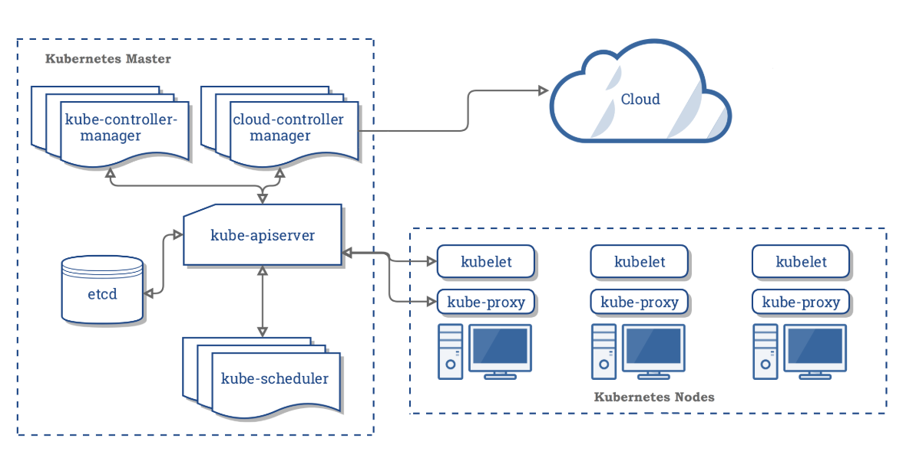

# Kubernetes Components

When you deploy Kubernetes, you get a cluster.

A cluster is a set of machines, called nodes, that run containerized applications managed by Kubernetes. A cluster has at least *one* worker node and at least *one* master node.

The worker node(s) host the pods that are the components of the application. The master node(s) manages the worker nodes and the pods in the cluster. Multiple master nodes are used to provide a cluster with failover and high availability.

This document outlines the various components you need to have a complete and working Kubernetes cluster.

Here's the diagram of a Kubernetes cluster with all the components tied together:

  

## Master Components

Master components provide the cluster's **control plane**. The master components *make global decisions* about the cluster(i.e. scheduling), and they detect and respond to cluster events(i.e. starting up a new pod when deployment's `replicas` field is unsatisfied).

Master components can be run on any machine in the cluster. However, for simplicity, set up scripts typically start all master components on the same machine, and do not run user containers on this machine.

### kube-apiserver

The API server is a component of the Kubernetes control plane that exposes the Kubernetes API. The API server is the *front end for the Kubernetes control plane*.

The main implementation of a Kubernetes API servier is **kube-apiserver**. kube-apiserver is designed to scale __horizontally__ - that is, it scales by deploying more instances. You can run several instances of kube-apiserver and balance traffic between those instances.

### etcd

Consistent and highly-available *key value* store used as Kubernetes' backing store for all cluster data.

### kube-scheduler

Component *on the master* that watches newly created pods that have no node assigned, and selects a node for them to run on.

### kube-controller-manager

Component *on the master* that runs controllers.

Logically, each controller is a separate process, but to reduce complexity, they are all compiled into a single binary and run in a single process.

These controllers include:

- **Node Controller**: Responsible for noticing and responding when nodes go down

- **Replicatoin Controller**: Responsible for maintaining the correct number of pods for every replication controller object in the system

- **Endpoints Controller**: Populates the Endpoint object(that is, joins Services & Pods)

- **Service Account & Token Controllers**: Create default accounts and API access tokens for new namespaces

### cloud-controller-manager

cloud-controller-manager runs controllers that interact with the underlying cloud providers.

cloud-controller-manager runs cloud-provider-specific controller loops only. You must disable these controller loops in the kube-controller-manager.

cloud-controller-manager allows the cloud vendor's code and the Kubernetes code to evolve independently of each other.

The following controllers have cloud provide dependencies:

- **Node Controller**: For checking the cloud provider to determine if a node has been deleted in the cloud after it stops responding

- **Route Controller**: For setting up routes in the underlying cloud infrastructure

- **Service Controller**: For creating, updating and deleting cloud provider load balancers

- **Volume Controller**: For creating, attaching, and mounting volumes, and interacting with the cloud provider to orchestrate volumes

  

## Node Component

Node components run on every node, maintaing running pods an dproviding the Kubernetes runtime environment.

### kubelet

An agent that runs on *each node* in the cluster. It makes sure that containers are running in a pod.

### kube-proxy

kube-proxy is a network proxy that runs on each node in your cluster, implementing part of the Kubernetes Service concept.

kube-proxy maintains network rules on nodes. These network rules allow network communication to your Pods from network sessions inside or outside of your cluster.

### Container Runtime

The container runtime is the software that is responsible for running containers(i.e. Docker, containerd, cri-o)
