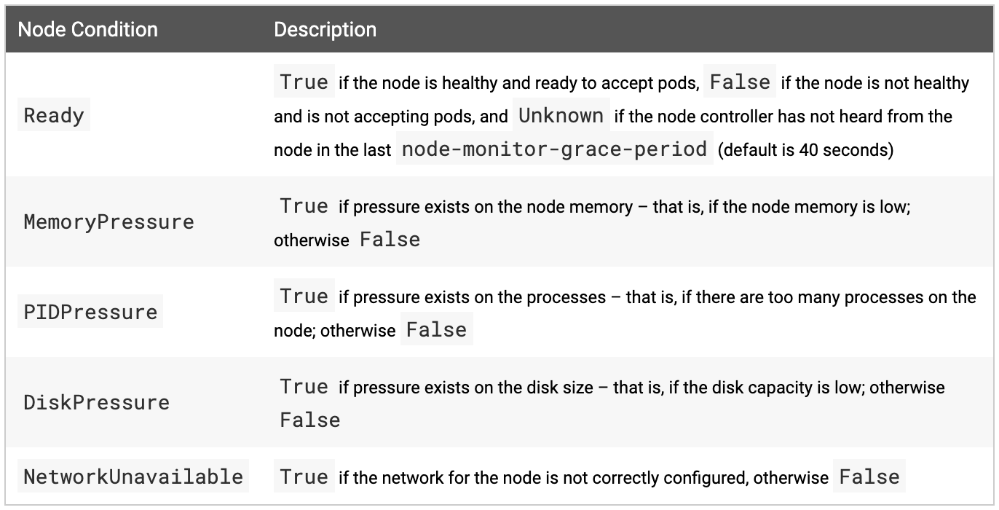

# Nodes

A node is a *worker machine* in Kubernetes, previously known as a `minion`. A node may be a VM or physical machine, depending on the cluster. Each node contains the services necessary to run `pods` and is managed by the `master component`. The services on a node include the *container runtime*, *kubelet* and *kube-proxy*.

## Node Status

A node's status contians the following information:

- Addresses

- Conditions

- Capacity and Allocatable

- Info

Node status and other details about a node can be displayed using below command:

```bash
kubectl describe node <insert-node-name-here>
```

Each section is described in detail below.

### Addresses

The usage of these fileds varies depending on your cloud provider or bare metal configuration.

- HostName: The hostname as reported by the node's kernel. Can be overridden via the kubelet `--hostname-override` parameter

- ExternalIP: Typically the IP address of the node that is externally routable(available from outside the cluster)

- InternalIP: Typically the IP address of the node that is routable only within the cluster

### Conditions

The `conditions` field describes the status of all `Running` nodes. Examples of conditions include:



The node condition is represented as a JSON object. For example, the following response dsecribe a healthy node.

```json
"conditions": [
  {
    "type": "Ready",
    "status": "True",
    "reason": "KubeletReady",
    "message": "kubelet is posting ready status",
    "lastHeartbeatTime": "2019-06-05T18:38:35Z",
    "lastTransitionTime": "2019-06-05T11:41:27Z"
  }
]
```

If the Status of the Ready condition remains `Unknown` or `False` for longer than the `pod-eviction-timeout`, an argument is passed to the kube-controller-manager and all the pods on the node are scheduled for deletion by the Node Controller. The default eviction timeout duration is **five minutes**. In some cases when the node is unreachable, the apiserver is unable to communicate with the kubelet on the node. The decision to delete the pods cannot be communicated to the kubelet until communication with the apiserver is re-established. In the meantime, the pods that are scheduled for deletion may contitnue to run on the partitioned node.

### Capacity and Allocatable

Describes the resources available on the node: CPU, memory and the maximum number of pods that can be scheduled onto the node.

The fileds in the capacity block indicate the total amount of resources that a Node has. The allocatable block indicates the amount of resources on a Node that is available to be consumed by normal Pods.

### Info

Describes general information about the node, such as kernel version, Kubernetes version.

<br></br>

## Management

Unlike pods and services, a node is not inherently created by Kubernetes: it is created externally by cloud providers like Google Compute Engine, or it exists in your pool of physical or virtual machines. So when Kubernetes creates a node, it creates an object that represents the node. After creation, Kubernetes checks whether the node is valid or not. For example, if you try to create a node from the following content:

```json
{
  "kind": "Node",
  "apiVersion": "v1",
  "metadata": {
    "name": "10.240.79.157",
    "labels": {
      "name": "my-first-k8s-node"
    }
  }
}
```

Kubernetes creates a node object internally(the representation), and validates the node by health checking based on the `metadata.name` field. If the node is valid - that is, if all necessary services are running - it is eligible to run a pod. Otherwise, it is ignored for any cluster activity until it becomes valid.

Currently, there are three components that interact with the Kubernetes node interface: node controller, kubelet, and kubectl.

### Node Controller

The node controller is a Kubernetes master component which manages various aspects of nodes.

The node controller has multiple roles in a node's life. The first is assigning a CIDR block to the node when it is registered(if CIDR assignment is turned on).

The second is keeping the node controller's internal list of nodes up to date with the cloud provider's list of available machines. When running in a cloud environment, whenever a node is unhealthy, the node controller asks the cloud provider if the VM for that node is still available. If not, the node controller deletes the node from its list of nodes.

The third is monitoring the nodes' health. The node controller is responsible for updating the NodeReady contition of NodeStatus to ConditionUnknown when a node becomes unreachable(i.e. the node controller stops receiving heartbeats for some reason, e.g. due to the node being down), and then laster evicting all the pods from the node(using graceful termination) if the node continues to be unreachable. The node controller checks the state of each node every `--node-monitor-period` seconds.

#### Heartbeats

Heartbeats, sent by Kubernetes nodes, help determine the availablity of a node. There are two forms of heartbeats: updates of `NodeStatus` and the lease object. Each Node has an associated Lease object in the `kube-node-lease` namespace. Lease is a lightweight resource, which improves the performance of the node heartbeats as the cluster scales.

The kubelet is responsible for creating and updating the `NodeStatus` and a Lease object.

- The kubelet updates the `NodeStatus` either when there is change in status, or if there has been no update for a configured interval.

- The kubelet creates and then updates its Lease object every 10 seconds. Lease updates occur independently from `NodeStatus` updates.

### Self-Registration of Nodes

When the kubelet flag `--register-node` is true(the default), the kubelet will attempt to register itself with the API server. This is the preferred pattern, used by most distros.

For self-registration, the kubelet is started with the following options:

- `--kubeconfig` - Path to credentials to authenticate itself to the apiserver

- `--cloud-provider` - How to talk to a cloud provider to read metadata about itself

- `--register-node` - Automatically register with the API server

- `--register-with-taints` - Register the node with the given list of taints

- `--node-ip` - IP address of the node

- `--node-labels` - Labels to add when registering the node in the cluster

- `--node-status-update-frequency` - Specifies how often kubelet posts node status to master
