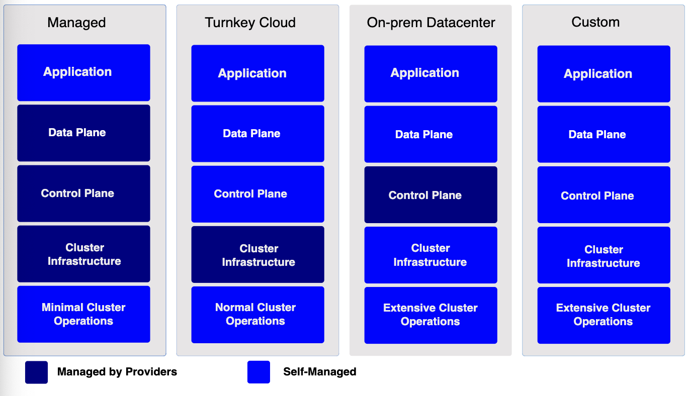

# Getting Started

This section covers different options to set up and run Kubernetes.

Different Kubernetes solutions meet different requirements; ease of maintenance, security control, available resources, and expertise required to operate and manage a cluster.

You can deploy a Kubernetes cluster on a local machine, cloud, on-prem datacenter; or choose a managed Kubernetes cluster. You can also create custom solutions across a wide range of cloud providers, or bare metal environments.

More simply, you can create a Kubernetes cluster in learning and production environment.

## Learning Environment

If you're learning Kubernetes, use the Docker-based solutions: tools supported by the Kubernetes community, or tools in the ecosystem to set up a Kubernetes cluster on a local machine

## Production environment

When evaluating a solution for a production environment, consider which aspects of operating a Kubernetes cluster(or *abstractions*) you want to manage yourself or offload to a provider.

Some possible abstractions of a Kubernetes clusters are applications, data plane, control plane, cluster infrastructure, and cluster operations.

The following diagran lists the possible abstractions of a Kubernetes cluster and whether an abstraction is self-managed or managed by a provider:

Production environment solutions:

