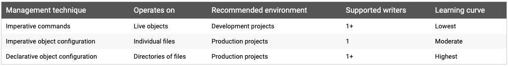

# Kubernetes Object Management

The `kubectl` command-line tool supports several different ways to create and manage Kubernetes objects.

## Management techniques

***WARNING: A Kubernetes objecct should be managed using only one technique. Mixing and matching techniques for the same object results in undefined behavior***



## Imperative commands

When using imperative commands, a user operates directly on live objects in a cluster. The user provides operations to the `kubectl` command as arguments or flags.

This is the simplest way to get started or to run a one-off task in a cluster. Because this technique operates directly on live objects, it provides no history of previous configurations.

### Examples

Run an instance of the nginx container by creating a Deployment object:

```sh
kubectl run nginx --image nginx
```

Do the same thing using a different syntax:

```sh
kubectl create deployment nginx --image nginx
```

### Trade-offs

Advantages compared to object configuration:

- Commands are simple, easy to learn and easy to remember

- Commands require only a single step to make changes to the cluster

Disadvantages compared to object configuration:

- Commands do not integrate with change review processes

- Commands do not provide an audit trail associated with changes

- Commands do not provide a source of records exampt for what is live

- Commands do not provide a template for creating new objects

## Imperative object configuration

In imperative object configuration, the kubectl command specifies the operation(create, replace, etc), optional flags and at least one file name. The file specified must contain a full definition of the object in YAML or JSON format.

### Example

Create the objects defined in a configuration file:

```sh
kubectl create -f nginx.yaml
```

Delete the objects defined in two configuration files:

```sh
kubectl delete -f nginx.yaml -f redis.yaml
```

Update the objects defined in a configuration file by overwriting the live configuration:

```sh
kubectl replace -f nginx.yaml
```

### Trade-offs

Advantages compare to imperative commands:

- Object configuration can be stored in a source control system such as Git

- Object configuration can integrate with processes such as reviewing changes before push and audit trails

- Object configuration provides a template for creating new objects

Disadvantages compared to imperative commands:

- Object configuration requires basic understanding of the object schema

- Object configuration requires the additional step of writing a YAML file

Advantages comapred to declarative object configuration:

- Imperative object configuration behavior is simpler and easier to understand

- As of Kubernetes version 1.5, imperative object configuration is more mature

Disadvantages compared to declarative object configuration:

- Imperative object configuration works best on files, not directories

- Updates to live objects must be reflected in configuration files, or they will be lost during the next replacement

<br></br>

## Declarative object configuration

When using declarative object configuration, a user operates on object configuration files stored locally, however the user does not define the operations to be taken on the files. Create, update, and delete operations are automatically detected per-object by `kubectl`. This enables working on directories, where different operations might be needed for different objects.

### Examples

Process all object configuration files in the `configs` directory, and create or patch the live objects. You can first `diff` to see what changes are going to be made, and then apply:

```sh
kubectl diff -f configs/
kubectl apply -f configs/
```

Recursively process directories:

```sh
kubectl diff -R -f configs/
kubectl apply -R -f configs/
```

### Trade-offs

Advantages compared to imperative object configuration:

- Changes made directly to live objects are retained, even if they are not merged back into the configuration files

- Declarative object configuration has better support for operating on directories and automatically detecting operation types(create, patch, delete) per-object

Disadvantages compared to imperative object configuration:

- Declarative object configuration is harder to debug and understand results when they are unexpected

- Partial updates using diffs create complex merge and patch operations